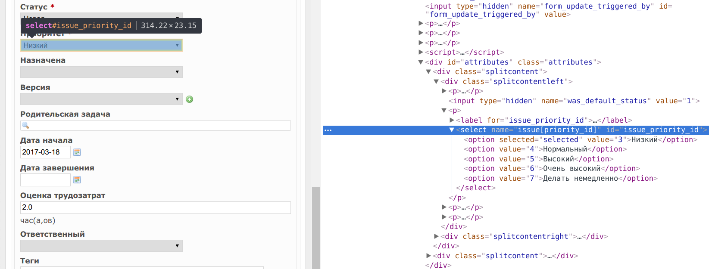

# Redmine Priorities Due Date Plugin

This Redmine plugin changes the due date automatically when user changes priority of an issue at the issue edit dialog.

## Installation
```
cd redmine-install-dir/plugins
git clone https://github.com/cmrd-senya/redmine_priorities_duedate_js.git
```

## Configuration

At [priorities_duedate.js](assets/javascripts/priorities_duedate.js) find `prioritiesDue` hashmap:
```js
var prioritiesDue = {
  "3": 180,
  "4": 30,
  "5": 7,
  "6": 3,
  "7": 1
};
```
This hash map is used for mapping default day count to priorities. The hash index is a identifier of a priority (according to redmine database) and the value is default days number for the priority. Change them according to your needs.

Here are how the priorities respective to the defaults look like in the HTML inspector:

 